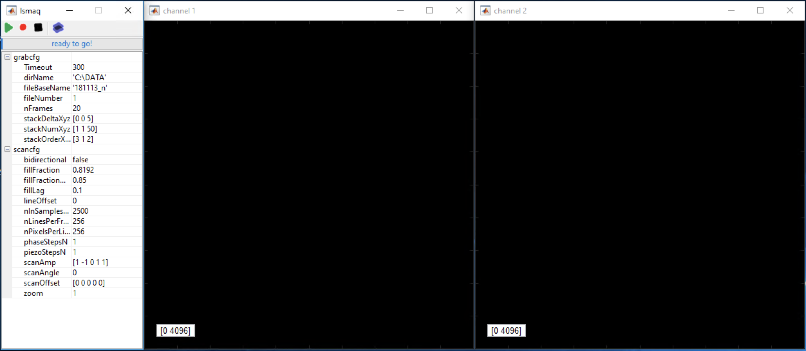

# LSMAQ
LSMAQ is a lightweight and flexible laser scanning microscope acquisition software written in MATLAB. It supports National Instruments hardware for galvo-based scanning.

## Should I use it?
Most likely not. If you are an end user of laser scanning microscopes, you will probably be well served by existing software packages like [ScanImage](http://scanimage.vidriotechnologies.com). The ScanImage team does a very good job at keeping their software up to date with new developments that most end users are interested in.

LSMAQ was created by microscope developers aiming for increased flexibility and ease of customisation. Scripting and quick code modification are facilitated by a clear separation between scanning engine and UI frontend, as well as a lightweight and minimal code base. Adding a new custom property to the UI takes a single line.

To minimize code and maximize flexibility, LSMAQ exposes all scanning parameters, performs very few checks on user input and generally assumes that the user knows the hardware limitations of their setup. The LSMAQ team cannot offer support to end users.

Present capabilities include tiled volume acquisition, arbitrary plane piezo-based scanning and phase-stepping for wavefront shaping / [deep imaging](https://doi.org/10.1038/nphoton.2016.252). LSMAQ supports galvo-based scanning but does not presently support resonant scanners.

## Requirements
- MATLAB (tested with version 2018b, earlier versions since 2009a likely supported). The DAQ toolbox is *not* required as LSMAQ directly calls NI-DAQmx functions through MATLAB's .NET interface.
- National Instruments data acquisition hardware: at least one high-speed (MHz) multifunction NI DAQ board. Tested with NI USB-6356 (primary) and NI USB-6343 (secondary)

## Installation
1. Install NI-DAQmx, making sure to include .NET support (tested with version 18.5, earlier versions likely supported)
2. Clone this repository or copy the contents of this folder to your hard drive.
3. Open/edit rigClass.m to confirm that is reflects your DAQ hardware and wiring (see below)

## Wiring
LSMAQ will flexibly support your custom DAQ card wiring as long as that wiring is configured in rigClass.m. To make your life easier and minimise the edits needed, we suggest using the following default hardware wiring:

#### Primary DAQ card (e.g. NI USB-6356):
- PMT inputs: AI ports 0 and 1 (up to 8 input channels supported)
- Galvo outputs: AO ports 0 and 1
- Connect PFI12 to USER1 using the screw terminals (USER1 will be the trigger output port)
- Connect USER1 to PFI0 (trigger input)
- Connect PFI1 to the shutter

#### Optional: Secondary DAQ card for additional AO channels (e.g. NI USB-6343):
- Additional outputs (e.g. to Pockels cell or piezo): AO ports 0, 1, etc
- Connect PFI7 on the primary DAQ card to PFI7 on all other cards (AO clock sync)
- Connect USER1 on the primary DAQ card to PFI0 on all cards (trigger signal)

## Configure / customize
#### rigClass.m
Open rigClass.m to make sure the settings reflect your hardware and wiring.

#### defaultProps.m
This file defines the startup scan and grab properties. You can modify this file or start LSMAQ (section below) to adjust the properties in the UI.

## Properties

| Grab properties | Description |
| --- | --- |
| `dirName` | Save path. Image data and scan configuration are saved as .mat files in HDF5 format. Files can be opened in MATLAB and any other software that supports HDF5 (including FIJI/ImageJ with the HDF5 Plugin)
| `fileBaseName` | Each file name will start with this string
| `fileNumber` | The next file name will end with this number
| `nFrames` | Grab this many frames (per slice/tile)
| `stackNumXyz` | 3-element vector. When acquiring slices or tiles, acquire [x y z] slices/tiles along x, y, and z
| `stackDeltaXyz` | 3-element vector. Slice/tile separation along [x y z]. Example: to take a stack of 50 slices separated by 5 µm along Z, set stackNumXyz to `[1 1 50]` and stackDeltaXyz to `[0 0 5]`. To acquire a tiled volume of two tiles along X, 3 along Y and 50 slices along Z, with an X/Y tile separation of 200 µm, set stackNumXyz to `[2 3 50]` and stackDeltaXyz to `[200 200 5]`.
| `stackSequence` | 3-charater string. Aquire slices and tiles in this order. Example: to first move along Z, then X then Y, set this to 'ZXY' (default).
| **Scan properties** | **Description** |
| `bidirectional` | Toggle bi-directional scanning. `true` or `false`
| `fillFraction` | Fraction of the line not used for flyback. Recommendation for a standard 1.25 MHz analog input rate: 0.8192 (this is 1024/1250; having 1024 fill samples per 1 ms line makes binning by orders of 2 convenient)
| `fillLag` | Lag of the true position versus command position (dimensionless fraction of the line). Typical value: 0.1
| `nInSamplesPerLine` | Number of sample per line (including flyback). This setting sets the line rate. At 1.25 MHz, 1250 samples per line would result in a line rate of 1 kHz and 2500 samples in 0.5 kHz.
| `nLinesPerFrame` | Number of horizontal lines (vertical image size in pixels)
| `nPixelsPerLine` | Number of pixels per horizontal line (horizontal image size). This setting determines sample binning. `nPixelsPerLine` has to be a divisor of `nInSamplesPerLine * fillFraction`
| `piezoStepsN` | Number of slices that a piezo-based objective scanner is scanning along Z. Default value (without scanner): 1
| `phaseStepsN` | Number of phases scanned by a phase-stepper. Phase stepping is performed for each line. When stepping 4 phase steps, the Y mirror will only advance every 4 lines, so that each line is scanned 4 times. `phaseStepsN` has to be a divisor of `nLinesPerFrame`. Default value (no phase stepping): 1
| `scanAmp` | 2-element vector with X and Y scan amplitudes. Output voltages will be multiplied with this value. The default value, `[1 1]`, will result in a -1V to +1V voltage command signal to both galvos at zoom 1. Directions can be flipped by scaling with negative values. Example: `[1 -1]` will flip the Y-axis. Optional: 5-element vector with scan amplitudes for X, Y, Z-piezo, Pockels-cell, phase-stepper.
| `scanOffset` | 2-element vector with X and Y scan offsets. Output voltages will be offset by this value (after scaling). Default: `[0 0]`. Optional: 5-element vector with scan offsets for X, Y, Z-piezo, Pockels-cell, phase-stepper.
| `scanAngle` | 3-element vector of rotation angles (in degrees) along X, Y, or Z axis. Example: for a 30 deg rotation in the XY plane, set this property to `[0 0 30]`. With the help of an objective piezo, this can be used for arbitrary plane rotation in 3D, but make sure that the hardware supports the new fast axis direction (or slow down scanning until it does. Use sparingly and keep in mind that only one mirror is designed to be the fast one. Default: `[0 0 0]`
| `zoom` | Image zoom. Higher values result in smaller image sizes. Keep in mind that scanning speed may have to be lowered for lowest zoom levels (highest scan amplitudes). The zoom can also be set by using the mouse scroll wheel in the UI. Example: If `scanAmp = [1 1]` and `zoom = 2`, the output voltage range to the X galvo will be -0.5V to +0.5V (the output voltage range to the Y galvo depends on the image size in pixels, as the pixel aspect ratio is kept at 1 when both scanAmp values are the same).

## Quick start
Type `lsmaq` to run. This should open a property window and one or more channel windows.



Use the property window to edit the configuration. Press enter when done editing or click outside the text field. Start scanning by pressing the play button. Adjust the zoom with the mouse scroll wheel. Stop by pressing play again or by pressing the stop button. Grab with the record button. Record  stacks or tiled volumes with the blue button. Close the LSMAQ UI by closing the property window (press 'X').

To control LSMAQ from the command line, use this alternative way to start lsmaq: `[rig, prop, hIm] = lsmaq;`. This will still open a UI as above, but it will also allow you to do the following:
- You can adjust scan and grab properties (`prop.scancfg` and `prop.grabcfg`) using your own code. For example, type `prop.scancfg.zoom = 4` in the matlab prompt. This will immediately adjust the UI. The link is bidirectional. If you change a property in the UI, it will be updated in `prop`.
- You can start scanning using command-line. Type `data = grabStream(rig, prop, hIm);` to grab data using the configuration in `prop` (this will display data while it is acquired. To run entirely without display, omit the third parameter and type `data = grabStream(rig, prop);`)

#### Example 1: acquire 5 images at zoom levels 1 to 5
Start lsmaq with `[rig, prop, hIm] = lsmaq;`. You can use the UI to find a sample area of interest. Stop scanning, then execute this code to loop through zoom levels.

```matlab
prop.grabcfg.nFrames = 1;
for i = 1:5
  prop.scancfg.zoom = i;
  data(:,:,:,:,i) = grabStream(rig, prop, hIm);
end
```

## Under the hood

LSMAQ consists of a command-line scan engine with a UI on top.
- Scan engine
  - `grabStream` is the main scan function. Its takes hardware information (initialized by `rigClass`) plus scan/grab configuration (e.g. from `defaultProps`) and outputs image data. It talks to `makeScanPattern` to create analog output signals and `raw2pixeldata` to process raw analog input into image frames.
- UI
  - `lsmaq` starts the UI, consisting of channel figures created by `chanfig` and a property table of a `dynamicshell` object. Stacks and tiled volumes are saved with the help of `matmap`, a convenient way to preallocate large data sets on the disk and save them in compressed HDF5 format.
  - `dynamicshell` is a class to turn a MATLAB structure into an object that can be passed by reference. Its members can be previewed in a simple property table, forming the main part of the LSMAQ property window.

The following examples will illustrate the purpose of these functions, and how the UI sits on top of the command-line code.

#### Example 2: command-line acquisition without any graphics
```matlab
%initialize your hardware
rig = rigClass;
%load default scan and grab configuration as a structure
prop = defaultProps;
%change configuration as needed, for example:
prop.grabcfg.nFrames = 10;
prop.scancfg.nLinesPerFrame = 512;
prop.scancfg.nPixelsPerLine = 512;
%acquire:
data = grabStream(rig, prop);
```

#### Example 3: same as above, but with a simple UI for changing properties
Here we will turn the `prop` structure into a `dynamicshell` object. This object will still look and feel a lot like a MATLAB structure (you can read and write its fields in the usual way), with two important differences: First, you can pass the data by reference. Second, there is a simple UI to inspect its fields graphically.

```matlab
%initialize your hardware
rig = rigClass;
%load default scan and grab configuration
prop = defaultProps;
%convert the structure into a `dynamicshell` object.
prop = dynamicshell(prop)
%inspect the object in a property table
prop.inspect
%add two channel figures
hIm(1) = chanfig(1)
hIm(2) = chanfig(2)
%when done, acquire:
data = grabStream(rig, prop, hIm);
```

This is, more or less, what `lsmaq` does – plus colored buttons.

## Wish list
- Stage support: right now only the Sutter MP285 stage is supported and this is more hard-coded than necessary. Should be easy to fix, probably once the need for a different stage arises.
- Resonant scanning. Two possible avenues would be to build on top of Vidriotech's code for NI FPGA-based acquisition or interface fast DAQ cards, e.g. from Alazartech (see [Scanbox](https://scanbox.org/) or [ScanImage B](https://ptrrupprecht.wordpress.com/2016/12/01/matlab-code-for-instrument-control-of-a-resonant-scanning-microscope/))

## Contributors
Benjamin Judkewitz, Ioannis Papadopoulos, Spencer Smith, Maximilian Hoffmann
